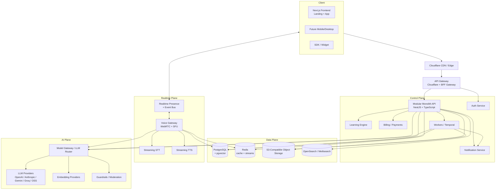
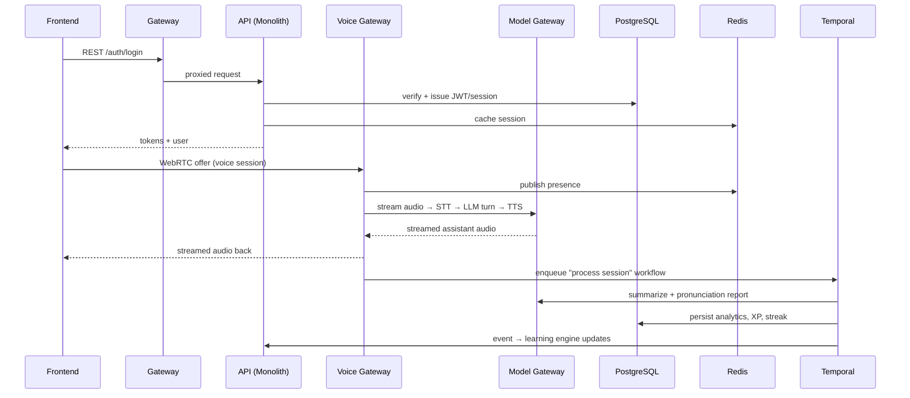
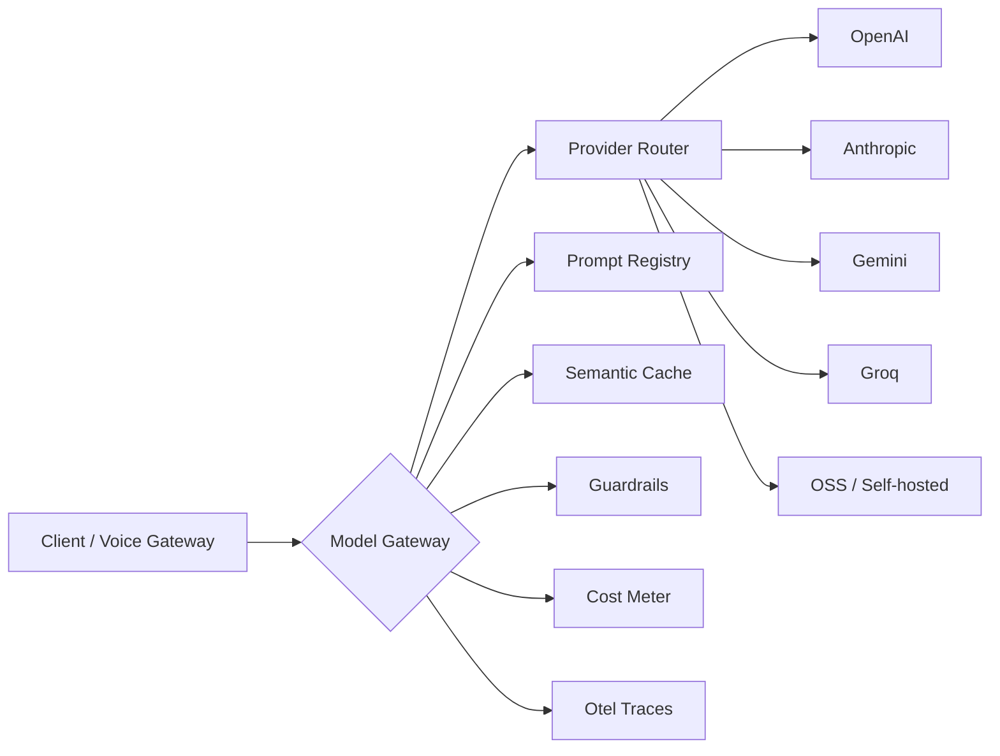
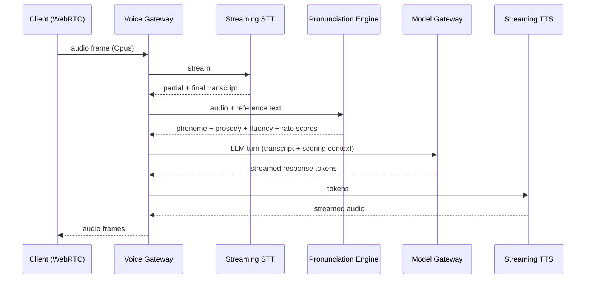
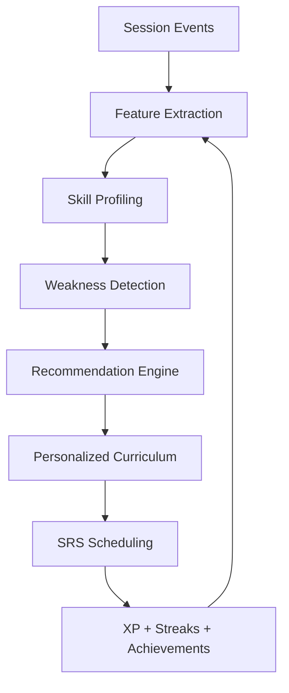

# FluentAI — Production Backend Architecture & Technical Design Document

**Version:** 1.0  
**Status:** Draft for review  
**Owner:** Platform Engineering  
**Last updated:** 2026-08-07  

> This document is the authoritative technical design for FluentAI's backend. It is written to be **executable by an
> engineering team** — every section gives a decision, the rationale, trade-offs, and concrete implementation
> guidance. It assumes a **monorepo** shared with the existing Next.js frontend.

---

# 1. Product Architecture

## 1.1 High-Level Architecture

FluentAI is an AI-first SaaS that turns open-ended, accent-aware voice conversations into measurable English-learning
outcomes. The system is split into a small set of **domain services** coordinated through a **modular monolith** core
plus **latency-critical satellite services** for realtime voice and AI inference.



## 1.2 Services and Their Responsibilities

### 1.2.1 Modular Monolith API (Control Plane core)
One deployable containing most business logic, broken into internal modules (`auth`, `users`, `billing`,
`conversations`, `learning`, `analytics`, `notifications`, `admin`). Rationale: the product is data-heavy but the
domain is cohesive; a monolith minimizes cross-service latency, transactional complexity, and operational overhead at
startup while still giving modularity boundaries for later extraction.

### 1.2.2 Auth Service
Authentication and authorization (sessions, OAuth, passkeys, MFA, RBAC). Rationale: auth is high-risk, changes
slowly, and benefits from being isolated and audited. Kept as an internal module of the monolith first, extracted to a
dedicated service when OAuth surface and security review demand it.

### 1.2.3 Learning Engine
The "brain" of the product: XP, streaks, spaced repetition, weakness detection, personalized curriculum, and
recommendations. Rationale: this is FluentAI's product moat and evolves fastest; it is intentionally module-bound with
an internal event interface so it can be replaced or upgraded independently.

### 1.2.4 Billing / Payments Service
Subscriptions, invoices, payment intents, webhooks. Rationale: Stripe-adjacent logic (idempotency, webhook replay,
3D-Secure, dunning) is fiddly and must not couple to learning logic.

### 1.2.5 Notification Service
Transactional email, in-app, and push. Rationale: delivery must be retryable, templated, and deliverability-tracked
without blocking the API.

### 1.2.6 Voice Gateway (latency-critical satellite)
WebRTC signaling, audio relay, and orchestration of the realtime STT→LLM→TTS loop. Rationale: conversational voice
has hard latency budgets (target <300ms per turn hop) that can't tolerate sharing the general request path. It scales
independently and can be written in Go for concurrency.

### 1.2.7 Model Gateway / LLM Router (AI satellite)
Provider-agnostic LLM + embedding + speech access with fallback, routing, caching, retries, guardrails, and
observability. Rationale: AI providers fail and change; a gateway contains the blast radius and centralizes cost and
safety.

### 1.2.8 Background Worker Plane (Temporal)
Durable workflows for anything long-running: session summarization, pronunciation report generation, weekly emails,
renewals, exports, media processing. Rationale: durable execution gives retries, idempotency, and visibility that ad
hoc queues lack.

### 1.2.9 Observability Plane
OpenTelemetry collection, traces, metrics, logs, alerts. Rationale: cross-cutting; designed in from day one.

## 1.3 Why This Shape

- **Start small, draw clean boundaries.** A modular monolith ships in weeks, not quarters, while the *data plane* and
  *satellite services* (voice, AI) are deliberately separable from day one.
- **Latency and money separate the planes.** Realtime voice and model calls are the two places where FluentAI both
  spends money and risks UX; both get their own scaling path and cost controls.
- **Durability is a first-class primitive.** AI/voice work is inherently long-running and failure-prone; Temporal
  makes that safe.

---

# 2. System Design

## 2.1 Component Design

| Component | Technology | Purpose |
|---|---|---|
| Frontend | Existing Next.js + React (App Router) | Landing + authenticated app shell; WebRTC client |
| API Gateway / Edge | Cloudflare (Tunnel/Workers) → internal BFF | TLS, WAF, rate-limit at edge, bot mitigation, CDN |
| Backend | NestJS modular monolith | Business logic, REST APIs, events |
| Realtime | Voice Gateway (Go) + Socket.io/WS + Redis pub/sub | Signaling, presence, streaming events |
| Database | PostgreSQL 16 (+ pgvector) | Primary OLTP store, embeddings, JSONB audit |
| Cache | Redis 7 | Sessions, hot data, rate limits, streams, pub/sub |
| Search | OpenSearch (or Meilisearch at startup) | Vocabulary, scenarios, admin search |
| Object Storage | S3-compatible (R2 at startup → AWS S3 at scale) | Audio, avatars, exports |
| Queue / Orchestration | Temporal + Redis Streams | Durable workflows + fan-out jobs |
| AI | Model Gateway over OpenAI/Anthropic/Gemini/Groq/OSS | LLM, embeddings, moderation |
| Voice | Deepgram/AssemblyAI (STT+pronunciation), ElevenLabs/OpenAI (TTS) | Streaming speech |
| Monitoring | OpenTelemetry + Grafana/Loki/Tempo + Sentry | Traces, logs, metrics, errors |

## 2.2 Communication Between Services



- **Synchronous:** REST/JSON via gateway for CRUD and auth.
- **Realtime:** WebSocket for presence/progress/typing; WebRTC for audio.
- **Async:** domain events published to Redis Streams / Temporal; workers consume with at-least-once delivery and
  idempotent consumers.

---

# 3. Backend Tech Stack

| Concern | Choice | Rationale |
|---|---|---|
| Runtime | Node.js 22 LTS | Shared TS tooling with frontend; V8 JIT fine for I/O-bound API |
| Language | TypeScript (strict) | Type safety, shared types with Next.js, ecosystem depth |
| Framework | NestJS | DI, modular architecture, first-class decorators, mature |
| API layer | NestJS controllers + class-validator + OpenAPI | Declarative validation and docs |
| Validation | `class-validator` + `zod` at boundaries | DTO validation + runtime schema for AI structured outputs |
| ORM | Prisma | Schema-as-code, migrations, type-safe queries |
| Migration | Prisma Migrate | Versioned, reviewable SQL migrations |
| Auth | `lucia` + custom, or Auth.js; Passkeys via WebAuthn lib | Session-first with token fallback |
| Authorization | CASL / custom policy engine + RBAC | Per-resource abilities |
| Caching | Redis (`ioredis`) | Sessions, rate limits, hot reads, streams |
| Queue | Temporal (durable) + BullMQ (fan-out) | Long workflows + simple jobs |
| Search | Meilisearch (start) → OpenSearch (scale) | Low-ops start, richer queries later |
| Storage | Cloudflare R2 → AWS S3 | Zero-egress start, scalable later |
| Realtime | Socket.io (WS) + Go Voice Gateway + WebRTC | Presence vs. audio separation |
| Monitoring | OpenTelemetry + Prometheus/Grafana/Loki/Tempo + Sentry | Vendor-neutral, standard |
| Logging | Pino → Loki | Low-overhead structured JSON logs |
| Analytics | ClickHouse (scale) + warehouse (BigQuery) | High-cardinality learning/usage events |
| Rate limiting | Redis sliding-window + edge (Cloudflare) | Defense in depth |
| API Gateway | Cloudflare (edge) + NestJS BFF | TLS, WAF, DDoS, rate limit at edge |
| Payments | Stripe (+ Stripe Tax) | Mature, webhook-reliable |
| Email | Resend / SES + Postmark | Deliverability + templating |
| Feature flags | Unleash (self-host) or Flagsmith | Progressive delivery |

**Decision rationale for the two "surprising" picks:**

- **NestJS over Fastify/Express-only:** DI and module boundaries make the *modular monolith → microservices* path
  tractable — modules map to future services.
- **Temporal over a plain Redis queue:** LLM/voice workflows need retries, timeouts, compensation, and human
  review; hand-rolling that is a multi-quarter effort. Temporal buys it now.

---

# 4. Microservice vs Modular Monolith

## 4.1 Recommendation: **Modular Monolith (start) → Microservices (as needed)**

## 4.2 Modular Monolith — Pros
- One deploy, one database transaction context; **no distributed transactions** for core flows.
- Fast iteration; a 5–10 person team ships features daily.
- Lower infra and ops cost at startup (<$1–3k/mo stage).
- Simpler testing and local development; single `docker compose up`.
- Shared TypeScript types reduce contract churn.

## 4.3 Modular Monolith — Cons
- Harder to scale a single hot path (mitigated by the separate **Voice/Model satellites**).
- Team scaling friction past ~15–20 engineers.
- One failure domain for control-plane code (mitigated by redundancy + feature flags).
- Database is the scaling bottleneck eventually (mitigated by read replicas + vertical sharding later).

## 4.4 Migration Strategy
1. Enforce **strict module boundaries** (no cross-module imports; only via internal interfaces/events).
2. Keep the **Bounded Context** list (auth, billing, learning, conversations, analytics, notifications, admin).
3. Introduce an **anti-corruption layer**: each module exposes a port, the monolith provides adapters.
4. Extract **only** when one of these triggers: distinct scaling need, distinct compliance boundary, team ownership,
   or independent deploy cadence.
5. First candidates to extract (in order): **Model Gateway**, **Voice Gateway** (already separate), **Billing**
   (PCI/webhook isolation), **Learning Engine** (performance).

## 4.5 Future Scaling
- **CQRS** becomes valuable only when reads (analytics dashboards, history) diverge from writes; add a read-optimized
  projection in ClickHouse before splitting services.
- **Vertical sharding** of Postgres by context (auth vs learning vs billing) precedes horizontal sharding.

---

# 5. Database Design

**Storage:** PostgreSQL 16 with `pgvector`, `citext`, `jsonb`. All tables use `BIGSERIAL` or `UUID` PKs. We use
**UUID v7** PKs (time-ordered, index-friendly) for high-write tables.

Common conventions:
- `created_at`, `updated_at` on every table (`updated_at` maintained by trigger or app).
- Soft-delete via `deleted_at` where applicable.
- Every row has an **audit trail** reference where required by policy.
- Encrypted at rest via Postgres `pgcrypto` column encryption for PII columns.

## 5.1 `users`

- **Purpose:** Core identity; authentication + billing + learning entity.
- **Columns:**
  | Column | Type | Notes |
  |---|---|---|
  | `id` | uuid | PK |
  | `email` | citext | unique, nullable (OAuth-only users may use provider email) |
  | `password_hash` | varchar | nullable (OAuth/passkey users) |
  | `status` | enum | `active`, `disabled`, `suspended`, `deleted` |
  | `email_verified_at` | timestamptz | null |
  | `mfa_secret_enc` | bytea | TOTP secret (encrypted) |
  | `locale` | varchar(8) | |
  | `tz_offset_min` | int | |
  | `created_at`, `updated_at`, `deleted_at` | timestamptz | |
- **Indexes:** PK; `email` unique; `status` partial index.
- **Relationships:** 1–N `sessions`, `profiles`, `conversations`, `subscriptions`, `achievements`, `streaks`.

## 5.2 `user_sessions`

- **Purpose:** Manageable, revocable sessions (web/mobile).
- **Columns:** `id`, `user_id` FK, `kind` (`web`|`mobile`|`sdk`), `refresh_token_hash`, `expires_at`,
  `last_active_at`, `device_id`, `ip`, `user_agent`, `revoked_at`, `created_at`.
- **Indexes:** `user_id`; `refresh_token_hash` unique; `expires_at`.
- **Constraints:** FK cascade delete on user.

## 5.3 `user_profiles`

- **Purpose:** Public + learning profile (avatar, level, bio).
- **Columns:** `user_id` (PK/FK), `display_name`, `avatar_url`, `target_language`, `native_language`,
  `english_level` enum (`A1`–`C2`), `goals` jsonb, `current_xp`, `level`, `timezone`, `settings` jsonb,
  `created_at`, `updated_at`.
- **Indexes:** PK; `english_level`; `current_xp`.
- **Constraints:** FK to `users`.

## 5.4 `oauth_accounts`

- **Purpose:** Link third-party identity providers.
- **Columns:** `id`, `user_id` FK, `provider` enum (`google`|`github`|`apple`), `provider_user_id`, `email`,
  `profile_payload` jsonb, `created_at`.
- **Indexes:** unique(`provider`, `provider_user_id`); `user_id`.
- **Constraints:** FK cascade.

## 5.5 `webauthn_credentials` (passkeys)

- **Purpose:** Passkey credential storage (WebAuthn).
- **Columns:** `id`, `user_id` FK, `credential_id` unique, `public_key` bytea, `counter`, `device_name`,
  `created_at`, `last_used_at`.
- **Indexes:** `credential_id` unique; `user_id`.

## 5.6 `plans`

- **Purpose:** Static subscription catalog.
- **Columns:** `id`, `code` unique, `name`, `description`, `price_cents`, `currency`, `billing_interval`
  (`monthly`|`yearly`), `features` jsonb, `is_active`, `trial_days`, `sort_order`, `created_at`, `updated_at`.
- **Indexes:** `code` unique; `is_active`.

## 5.7 `subscriptions`

- **Purpose:** Active subscriptions, Stripe-linked.
- **Columns:** `id`, `user_id` FK, `plan_id` FK, `stripe_customer_id`, `stripe_subscription_id` unique,
  `status` enum (`trialing`|`active`|`past_due`|`canceled`|`unpaid`), `current_period_start`, `current_period_end`,
  `cancel_at_period_end` bool, `created_at`, `updated_at`.
- **Indexes:** `user_id`; `stripe_subscription_id` unique; `status`.
- **Constraints:** FK; enforce one active subscription per user via partial unique index on `user_id WHERE status
  IN ('trialing','active','past_due')`.

## 5.8 `invoices`

- **Purpose:** Billing records mirrored from Stripe.
- **Columns:** `id`, `subscription_id` FK, `stripe_invoice_id` unique, `amount_due_cents`, `amount_paid_cents`,
  `currency`, `status`, `due_date`, `paid_at`, `invoice_pdf_url`, `created_at`.
- **Indexes:** `subscription_id`; `stripe_invoice_id` unique; `status`.

## 5.9 `payments`

- **Purpose:** Payment events ledger (idempotency anchor).
- **Columns:** `id`, `user_id` FK, `stripe_payment_intent_id` unique, `invoice_id` FK, `amount_cents`, `currency`,
  `status`, `failure_code`, `idempotency_key`, `created_at`.
- **Indexes:** `user_id`; `stripe_payment_intent_id` unique; `idempotency_key` unique.

## 5.10 `conversations`

- **Purpose:** A coaching session (conversational or voice).
- **Columns:** `id`, `user_id` FK, `type` (`free`|`roleplay`|`interview`|`meeting`|`ieltS`|`toefl`|`business`),
  `accent` enum, `scenario_id` FK nullable, `title`, `status` (`active`|`completed`|`aborted`),
  `started_at`, `ended_at`, `duration_s`, `summary` text, `embedding` vector(1536), `created_at`.
- **Indexes:** `user_id` + `created_at` (history); `type`; GIN/IVFFlat index on `embedding`.
- **Constraints:** FK cascade on user; partial unique on `(user_id, status='active')` to prevent parallel sessions.

## 5.11 `messages`

- **Purpose:** Individual turns in a conversation.
- **Columns:** `id`, `conversation_id` FK, `role` (`user`|`assistant`|`system`), `content` text, `language`,
  `accent`, `audio_url`, `audio_duration_s`, `prosody` jsonb, `meta` jsonb, `created_at`.
- **Indexes:** `conversation_id` + `created_at` (composite); GIN on `content` for search.
- **Constraints:** FK cascade.

## 5.12 `voice_sessions`

- **Purpose:** Raw + processed audio session metadata.
- **Columns:** `id`, `user_id` FK, `conversation_id` FK nullable, `stt_provider`, `tts_provider`, `audio_url`,
  `transcript_jsonb`, `vad_events` jsonb, `duration_s`, `status`, `cost_cents`, `created_at`.
- **Indexes:** `user_id` + `created_at`; `conversation_id`.
- **Constraints:** FK.

## 5.13 `pronunciation_reports`

- **Purpose:** Per-message pronunciation scoring.
- **Columns:** `id`, `message_id` FK, `overall_score` smallint, `segment_scores` jsonb (per phoneme), `mispronounced`
  jsonb, `word_stress` jsonb, `accent_accuracy` smallint, `model_used`, `created_at`.
- **Indexes:** `message_id` unique; `overall_score`.
- **Constraints:** FK cascade.

## 5.14 `grammar_reports`

- **Purpose:** Grammar + style analysis per message.
- **Columns:** `id`, `message_id` FK, `score` smallint, `issues` jsonb (type, severity, suggestion), `corrected_text`
  text, `model_used`, `created_at`.
- **Indexes:** `message_id` unique.
- **Constraints:** FK cascade.

## 5.15 `vocabulary_items`

- **Purpose:** Saved/learned vocabulary per user.
- **Columns:** `id`, `user_id` FK, `term`, `definition`, `example`, `level`, `word_class`, `added_from`
  (`manual`|`session`|`flashcard`), `status` (`new`|`learning`|`reviewing`|`mastered`), `review_count`,
  `streak_days`, `due_at`, `ease_factor` numeric, `interval_days`, `created_at`.
- **Indexes:** `user_id` + `status`; `due_at`; unique(`user_id`,`term`).
- **Constraints:** FK cascade.

## 5.16 `flashcards`

- **Purpose:** SRS flashcards.
- **Columns:** `id`, `user_id` FK, `vocabulary_item_id` FK, `front`, `back`, `interval_days`, `ease_factor`,
  `reps`, `next_review_at`, `created_at`.
- **Indexes:** `user_id` + `next_review_at`; `vocabulary_item_id`.
- **Constraints:** FK.

## 5.17 `learning_progress`

- **Purpose:** Daily + skill progress rollups.
- **Columns:** `id`, `user_id` FK, `date`, `skill` enum (`speaking`|`pronunciation`|`grammar`|`vocabulary`|`fluency`),
  `minutes`, `xp`, `accuracy_avg`, `fluency_avg`, `messages_count`, `sessions_count`, `created_at`.
- **Indexes:** unique(`user_id`,`date`,`skill`); `user_id` + `date`.
- **Constraints:** FK.

## 5.18 `achievements`

- **Purpose:** Achievement catalog + per-user progress.
- **Columns:** `id`, `user_id` FK nullable (null = catalog definition), `code` unique, `title`, `description`,
  `icon`, `criteria` jsonb, `progress_current`, `progress_target`, `is_unlocked`, `unlocked_at`, `created_at`.
- **Indexes:** `code` unique; `user_id` + `is_unlocked`.
- **Constraints:** FK.

## 5.19 `streaks`

- **Purpose:** Current + best streak tracking.
- **Columns:** `id`, `user_id` FK, `current_streak` int, `best_streak` int, `current_streak_start`, `last_active_date`,
  `freeze_available` bool, `created_at`, `updated_at`.
- **Indexes:** `user_id` unique.
- **Constraints:** FK unique per user.

## 5.20 `xp_ledger`

- **Purpose:** Immutable XP event log (auditable, recomputable).
- **Columns:** `id`, `user_id` FK, `amount` int, `reason` enum, `ref_id`, `occurred_at`.
- **Indexes:** `user_id` + `occurred_at`; `reason`.

## 5.21 `exercises`

- **Purpose:** Structured exercises (fill-in, MCQ, shadowing).
- **Columns:** `id`, `code` unique, `type`, `prompt`, `solution` jsonb, `accent`, `level`, `skill` jsonb, `difficulty`,
  `scenario_id` FK, `created_at`.
- **Indexes:** `type` + `level`; `code` unique.

## 5.22 `user_exercise_attempts`

- **Purpose:** Per-user attempt results (feeds weakness detection).
- **Columns:** `id`, `user_id` FK, `exercise_id` FK, `conversation_id` FK nullable, `score`, `responses` jsonb,
  `duration_s`, `feedback` jsonb, `attempt_number`, `created_at`.
- **Indexes:** `user_id` + `exercise_id`; `user_id` + `created_at`.

## 5.23 `scenarios` (roleplays)

- **Purpose:** Reusable roleplay/interview/meeting scenarios.
- **Columns:** `id`, `code` unique, `type`, `title`, `description`, `accent`, `level`, `industry`, `config` jsonb
  (assistant persona, opening, objectives), `is_active`, `embedding` vector(1536), `created_at`.
- **Indexes:** `type` + `level`; GIN/IVFFlat `embedding`.

## 5.24 `user_scenario_progress`

- **Purpose:** Progress through scenarios per user.
- **Columns:** `id`, `user_id` FK, `scenario_id` FK, `status` (`not_started`|`in_progress`|`completed`|`passed`),
  `attempts`, `best_score`, `completed_at`, `created_at`.
- **Indexes:** unique(`user_id`,`scenario_id`).

## 5.25 `analytics_events`

- **Purpose:** Raw event bus mirror for analytics (shipped to ClickHouse).
- **Columns:** `id`, `user_id` FK, `event` varchar, `properties` jsonb, `session_id`, `occurred_at`.
- **Indexes:** `occurred_at`; `event`; `user_id`.

## 5.26 `notifications`

- **Purpose:** In-app + push notifications.
- **Columns:** `id`, `user_id` FK, `type`, `channel` enum (`in_app`|`email`|`push`), `title`, `body`, `data` jsonb,
  `status` (`queued`|`sent`|`failed`|`delivered`|`read`), `delivered_at`, `read_at`, `created_at`.
- **Indexes:** `user_id` + `status`; `created_at`.

## 5.27 `audit_logs`

- **Purpose:** Immutable security/compliance trail.
- **Columns:** `id`, `actor_user_id` FK nullable, `actor_type`, `action`, `resource_type`, `resource_id`,
  `before` jsonb, `after` jsonb, `ip`, `user_agent`, `request_id`, `occurred_at`.
- **Indexes:** `resource_type` + `resource_id`; `actor_user_id`; `occurred_at`.

## 5.28 `api_keys`

- **Purpose:** Machine/partner access.
- **Columns:** `id`, `organization_id` FK nullable, `user_id` FK nullable, `key_prefix`, `key_hash` unique,
  `name`, `scopes` jsonb, `last_used_at`, `expires_at`, `revoked_at`, `created_at`.
- **Indexes:** `key_hash` unique.

## 5.29 `organizations` (teams)

- **Purpose:** Team/enterprise accounts.
- **Columns:** `id`, `name`, `slug` unique, `owner_user_id` FK, `tier` (`pro`|`teams`|`enterprise`),
  `billing_email`, `settings` jsonb, `created_at`, `updated_at`.
- **Indexes:** `slug` unique.

## 5.30 `organization_members`

- **Purpose:** Team membership + roles.
- **Columns:** `id`, `organization_id` FK, `user_id` FK, `role` (`owner`|`admin`|`member`), `status`
  (`invited`|`active`), `created_at`.
- **Indexes:** unique(`organization_id`,`user_id`); `user_id`.

## 5.31 `organization_reports`

- **Purpose:** Team benchmarking aggregates.
- **Columns:** `id`, `organization_id` FK, `period`, `metrics` jsonb, `generated_at`.
- **Indexes:** `organization_id` + `period`.

## 5.32 `idempotency_keys`

- **Purpose:** API idempotency ledger.
- **Columns:** `key` PK, `user_id`, `method`, `path`, `request_hash`, `response_status`, `response_body`,
  `created_at`.
- **Indexes:** PK; `user_id`.

## 5.33 `conversation_summaries`

- **Purpose:** Compressed context / rolling memory.
- **Columns:** `id`, `conversation_id` FK, `turn_start`, `turn_end`, `summary` text, `tokens`, `model_used`,
  `created_at`.
- **Indexes:** `conversation_id` + `turn_start`.

---

# 6. Authentication

## 6.1 Strategy
**Session-first with refresh-token rotation**, plus OAuth and passkeys. JWT only where statelessness is required
(short-lived, e.g. edge auth / API keys for SDK).

## 6.2 Methods
| Method | Library / Protocol | Notes |
|---|---|---|
| Email + password | `argon2id` hashing | Argon2id over bcrypt; OWASP-recommended |
| Google / GitHub | OAuth 2.0 / OIDC | PKCE always; link to existing account on conflict |
| Apple | Sign in with Apple | Required `name`/`email` privacy fields |
| Magic links | Time-limited signed URL | 15-min TTL, single-use, rate-limited |
| Passkeys | WebAuthn / FIDO2 | Platform authenticators + security keys |

## 6.3 Tokens
- **Access token:** short-lived (10–15 min), opaque or JWT; stored client-side in memory (web) / secure storage (mobile).
- **Refresh token:** long-lived (30 days), opaque, hashed at rest, **rotated on every use**; bound to a session row.
- **Rotation & reuse detection:** on refresh, issue a new refresh token and revoke the old; if a rotated token is
  replayed, revoke the entire session (theft detection).
- **Revocation:** all tokens are revocable via session kill; admin can revoke all sessions of a user.

## 6.4 Device & Session Management
- `user_sessions` rows carry device metadata; UI lists active sessions with revoke buttons.
- Cap concurrent sessions per user (e.g. 10); new sessions evict oldest.

## 6.5 Multi-Factor Authentication
- TOTP (WebAuthn-compatible authenticator apps) + recovery codes (single-use, hashed).
- Backed up 2FA on Apple/Google accounts via OAuth.

## 6.6 Password Reset & Email Verification
- Signed, time-limited tokens stored hashed; single-use; rate-limited per email and per IP.
- Verification link expires in 24h; re-send throttled.

## 6.7 RBAC & Admin Roles
- Roles: `user`, `org_owner`, `org_admin`, `org_member`, `admin`, `super_admin`.
- Permission model: resource-scoped abilities (CASL or custom policy engine) — e.g. `billing:manage`,
  `content:moderate`, `users:impersonate`.
- **Admin** access requires separate privileged session + step-up auth (re-auth + optionally MFA) for sensitive
  actions.

---

# 7. API Design

## 7.1 Conventions
- **REST over JSON** for the control plane; versioned by URL prefix `/v1`.
- **IDempotency:** clients send `Idempotency-Key` header for POSTs that create side effects (payments, uploads,
  exercise submissions); server dedupes via `idempotency_keys`.
- **Pagination:** cursor-based for lists (opaque `cursor` + `limit`), offset only for admin tables.
- **Filtering/sorting:** query params (`?status=active&sort=-created_at`).
- **Errors:** RFC 7807 problem+json.

## 7.2 Versioning
`/v1/...` in path. Semver for breaking change policy: additive changes never bump; breaking changes bump minor and
keep `/v1` for a deprecation window with `Sunset` headers.

## 7.3 Endpoint Map (grouped)

### Auth
```
POST   /v1/auth/register
POST   /v1/auth/login                 { email, password } | { oauth } | magic-link
POST   /v1/auth/magic-link/request
POST   /v1/auth/magic-link/verify
POST   /v1/auth/refresh
POST   /v1/auth/logout
POST   /v1/auth/password/reset/request
POST   /v1/auth/password/reset/confirm
GET    /v1/auth/mfa/status
POST   /v1/auth/mfa/enable
POST   /v1/auth/mfa/verify
GET    /v1/auth/webauthn/challenge
POST   /v1/auth/webauthn/register
POST   /v1/auth/webauthn/login
GET    /v1/sessions                 # active devices
DELETE /v1/sessions/:id
DELETE /v1/sessions                # revoke all
```

### Users & Profiles
```
GET    /v1/me
PATCH  /v1/me
GET    /v1/me/profile
PUT    /v1/me/profile
POST   /v1/me/avatar
DELETE /v1/me/avatar
DELETE /v1/me                       # GDPR account deletion
```

### Billing
```
GET    /v1/billing/plans
GET    /v1/billing/subscription
POST   /v1/billing/subscription          { plan_id, payment_method_id }
POST   /v1/billing/subscription/cancel
POST   /v1/billing/subscription/reactivate
GET    /v1/billing/invoices
POST   /v1/billing/payment-methods
POST   /v1/billing/portal-session        # Stripe customer portal
POST   /v1/webhooks/stripe               # webhook ingress
```

### Conversations & Learning
```
POST   /v1/conversations                 { type, accent, scenario_id? }
GET    /v1/conversations
GET    /v1/conversations/:id
POST   /v1/conversations/:id/messages    { content }  → streaming events
POST   /v1/conversations/:id/audio       # voice turn (multipart/streaming)
GET    /v1/conversations/:id/summary
GET    /v1/conversations/:id/reports
GET    /v1/vocabulary
POST   /v1/vocabulary
PATCH  /v1/vocabulary/:id
GET    /v1/flashcards/due
POST   /v1/flashcards/:id/review         { grade }
GET    /v1/scenarios
GET    /v1/scenarios/:id
POST   /v1/scenarios/:id/start
GET    /v1/progress/dashboard
GET    /v1/progress/history?skill=&period=
GET    /v1/achievements
GET    /v1/streaks
```

### Teams & Admin
```
POST   /v1/organizations
GET    /v1/organizations/:id
POST   /v1/organizations/:id/members
DELETE /v1/organizations/:id/members/:userId
GET    /v1/organizations/:id/reports
# Admin (RBAC-gated, step-up)
GET    /v1/admin/users
POST   /v1/admin/users/:id/impersonate
POST   /v1/admin/moderation/review
GET    /v1/admin/usage
```

## 7.4 Example — Create conversation

**Request**
```http
POST /v1/conversations
Authorization: Bearer <access_token>
Idempotency-Key: conv-9f2c1a
Content-Type: application/json

{
  "type": "interview",
  "accent": "british",
  "scenario_id": "scn_swe_interview"
}
```

**Response `201`**
```json
{
  "id": "conv_01J2X...",
  "type": "interview",
  "accent": "british",
  "status": "active",
  "started_at": "2026-08-07T09:00:00Z"
}
```

## 7.5 Example — Stream a message turn

```http
POST /v1/conversations/conv_01J2X/messages
Accept: text/event-stream
```
```text
event: token
data: {"delta": "Well, in my current role I focus on..."}
event: done
data: {"message_id": "msg_01J2Z", "grammar": {...}}
```

## 7.6 Error shape (RFC 7807)
```json
{
  "type": "https://api.fluentai.app/errors/rate_limited",
  "title": "Rate limit exceeded",
  "status": 429,
  "detail": "Too many requests. Retry after 30s.",
  "retry_after": 30,
  "request_id": "req_abc"
}
```

## 7.7 Rate limits (representative)
| Scope | Limit |
|---|---|
| Auth (login/register) | 5/min per IP |
| Chat turns | 60/min per user |
| STT/TTS | per-usage, plan-based |
| Public endpoints | 120/min per IP |
| Admin | 30/min per user |

## 7.8 OpenAPI
Generate from NestJS decorators (`@nestjs/swagger`) as the **single source of truth**. Publish an open spec to a
docs site and generate typed SDKs. Add contract tests (Pact) between API and frontend.

---

# 8. AI Orchestration Layer

## 8.1 Model Gateway (central component)



## 8.2 Components

| Component | Purpose |
|---|---|
| **Provider Router** | Picks provider+model per request based on task, latency, cost, reliability, and policy |
| **Fallback Router** | On error/timeout/rate-limit → retry on next provider |
| **Prompt Registry** | Versioned prompts stored in DB (not code); immutable versions, env-level activation |
| **Prompt Compiler** | Injects user context, accent, level, memory; assembles messages |
| **Memory Manager** | Conversation memory: short-term window + rolling summarization |
| **Context Compressor** | Summarizes/truncates old turns to fit token budget (see 8.3) |
| **Structured Output** | Enforces JSON schema (JSON mode / function calling) for reports, grades, plans |
| **Guardrails** | Input + output moderation, jailbreak detection, PII redaction (see 8.5) |
| **Model Router** | Routes embedding/chat/structured tasks to cheapest adequate model |
| **Cache** | Prompt cache + semantic cache (see 8.6) |
| **Resilience** | Retries w/ exponential backoff + jitter, timeouts, circuit breakers, rate-limit aware |
| **Cost & Usage Meter** | Records tokens/cost per request; feeds dashboards and budgets |
| **Telemetry** | Full OpenTelemetry spans: prompt, model, tokens, latency, cost |

## 8.3 Conversation Memory & Context Compression
- **Two-tier memory:** (1) in-window recent turns (e.g. last 12), (2) rolling summary refreshed every N turns or on
  token threshold.
- Summarization via a dedicated cheap model; summary stored in `conversation_summaries` and re-injected as a system
  message.
- Token budgeting: cap context; drop/compress oldest beyond budget.

## 8.4 Streaming
- All chat + TTS responses stream via SSE/WebSocket/WebRTC. The gateway streams provider tokens to the voice gateway
  for incremental TTS.

## 8.5 Guardrails & Safety
- **Input:** prompt-injection detection (classifier + heuristic), PII redaction, blocklist + allowlist, content
  policy moderation.
- **Output:** toxicity/safety classifier on assistant output before streaming to user; refuse flagged content.
- **Abuse:** per-user quota, anomaly detection on usage velocity.

## 8.6 Caching
- **Prompt caching:** provider-native (Anthropic/OpenAI) for the static system prefix → large cost cut.
- **Semantic caching:** embedding-similarity lookup of exact repeated requests (e.g. FAQ-like questions) → fast, cheap.

---

# 9. Voice Pipeline

## 9.1 Flow


## 9.2 Components & Choices
| Concern | Choice | Notes |
|---|---|---|
| Transport | WebRTC (Opus), SFU or P2P | Sub-200ms; NAT-friendly |
| VAD | Silero VAD (on-device) + server-side | On-device VAD starts STT fast, saves cost |
| Streaming STT | Deepgram / AssemblyAI (streaming) | Finalized + interim transcript |
| Pronunciation | Deepgram `phoneme` + AssemblyAI pronunciation scoring | Per-phoneme, word stress, accent accuracy |
| Prosody/fluency | Audio feature extraction + STT timings | Pauses, speech rate (WPM), filler words |
| TTS | ElevenLabs / OpenAI TTS (streaming) | Low-latency, accent-consistent voices |
| Orchestration | Voice Gateway (Go) | Keeps STT↔LLM↔TTS loop in-process |

## 9.3 Latency Optimization
- On-device VAD + streaming STT to cut perceived latency.
- Start TTS on the **first token** (token-level incremental TTS), not after full response.
- Pre-warm TTS connections per accent.
- Barge-in: user can interrupt; VAD detects and cancels TTS.
- Target budget: VAD <100ms, STT final <500ms, LLM first token <600ms, TTS first audio <300ms → turn gap ~1–1.5s.

## 9.4 Confidence & Fluency Scoring
- **Fluency score:** WPM vs. reference range, pause frequency/length, filler-word density.
- **Confidence score:** prosody stability, filled-pause ratio, self-correction count (heuristic, transparent to user).
- **Pronunciation:** phoneme-level edit distance vs. reference; accent-accuracy delta.

## 9.5 Audio Storage
- Upload audio segments to object storage post-session; keep a configurable retention (default 90 days for
  transcripts, 7 days raw audio; user-deletable; GDPR purgable).

---

# 10. Learning Engine

## 10.1 Core Loop


## 10.2 Components
| Component | Purpose |
|---|---|
| **Skill Profiling** | Maintain per-skill mastery (speaking, pronunciation, grammar, vocabulary, fluency) from session evidence |
| **Weakness Detection** | Identify recurring error patterns (e.g. specific phonemes, tense misuse) from reports |
| **Recommendation Engine** | Surface scenarios/exercises targeting detected weaknesses |
| **Personalized Curriculum** | Ranked path of lessons/scenarios for the user's level and goals |
| **SRS (spaced repetition)** | SM-2/FSRS scheduling for vocabulary + flashcards (`ease_factor`, `interval_days`, `due_at`) |
| **Vocabulary Ranking** | Score terms by utility + user weakness; schedule review |
| **Difficulty Progression** | Bump scenario difficulty as mastery thresholds are met |
| **Gamification** | XP ledger (immutable), streaks, achievements; all event-sourced for recomputation |

## 10.3 Event-Driven
The learning engine consumes **domain events** (`session_completed`, `message_graded`, `exercise_attempted`) from a
stream; it is decoupled from the API so it can be scaled/replaced independently.

## 10.4 Anti-gaming
- XP caps per day; streak "freeze" mechanics; fraud detection on impossible velocity (see §14).

---

# 11. Background Workers

## 11.1 Temporal Workflows (durable, long-running)
| Workflow | Trigger | Notes |
|---|---|---|
| `ProcessVoiceSession` | session end | Summarize, score, persist analytics, award XP |
| `GeneratePronunciationReport` | message end | Phoneme analysis (async path) |
| `SendWeeklyReport` | weekly cron | Per-user digest with progress + recommendations |
| `SubscriptionRenewal` | Stripe webhook | Handle dunning, grace, downgrade |
| `SendDailyReminder` | daily cron, timezone-aware | Streak reminders / push |
| `ExportUserData` | user request | GDPR data export → signed URL |
| `DeleteUser` | deletion request | Anonymize/delete PII + cascade (GDPR) |
| `GenerateThumbnails/Transcodes` | media upload | Avatar/audio processing |
| `RebuildSearchIndexes` | schedule/trigger | Meilisearch/OpenSearch sync |
| `CleanupTempUploads` | hourly | Purge expired temp objects + orphaned files |

## 11.2 BullMQ (fan-out, short)
- Notification dispatch fan-out, webhook delivery retries, email sending.

## 11.3 Reliability
- At-least-once delivery with **idempotent handlers** (dedupe by event `id`).
- Temporal provides retries, timeouts, and compensation automatically.
- Dead-letter + DLQ inspection dashboard.

---

# 12. Real-Time Architecture

| Channel | Use | Protocol |
|---|---|---|
| Presence & progress | "online", typing, XP ticker | WebSocket (Socket.io w/ Redis adapter), fallback SSE |
| Streaming AI text | incremental tokens | SSE / WebSocket |
| Voice streaming | audio | WebRTC (Opus) via Voice Gateway |
| Live notifications | in-app toasts | WebSocket push |
| Server→client sync | leaderboard/analytics refresh | WebSocket events |

## 12.1 Protocol Choices
- **WebRTC for audio** — sub-200ms, UDP-friendly, NAT traversal (STUN/TURN). TURN (e.g. Cloudflare TURN) for
  restrictive networks.
- **WebSocket for presence/text** — low overhead vs. polling; Socket.io gives auto-reconnect + Redis scaling.
- **SSE for one-way text streams** — simpler fallback where WS is unavailable and only server→client.

## 12.2 Scaling Realtime
- Redis pub/sub adapter for Socket.io across instances.
- Voice Gateway is **stateful** — sessions pinned to a gateway node; use sticky routing or a session registry in Redis
  so clients always reach the node holding their audio.

---

# 13. File Storage

## 13.1 Object Taxonomy & Lifecycle
| Category | Example | Lifecycle | CDN |
|---|---|---|---|
| Avatars | PNG/WebP | 256px/128px/64px variants; cached | yes |
| Session audio | Opus/WAV | raw 7d, transcript 90d | private (signed) |
| Reports | PDF/JSON exports | user-generated, retained | signed |
| User data export | ZIP | 7d then purge | signed |
| Images (content) | scenario art | permanent | yes |

## 13.2 Design
- S3-compatible (R2 start → S3 at scale); versioned buckets; SSE-KMS encryption.
- **Uploads:** pre-signed POST URLs, server-authoritative (client never gets raw keys).
- **Temp uploads:** dedicated `uploads/` prefix + TTL lifecycle policy; promoted to `private/` or `public/` on confirm.
- **CDN:** Cloudflare (R2) or CloudFront (S3) with cache-busting via content hashes.
- **Access:** private objects via short-lived signed URLs; never expose bucket to the client directly.

---

# 14. Security

## 14.1 Threat Model (stride summary)
Spoofing (auth), Tampering (webhooks, audio), Repudiation (audit logs), Info disclosure (PII, transcripts),
DoS (LLM abuse), Escalation (RBAC), Prompt injection (AI abuse).

## 14.2 OWASP Top 10 Mitigations
| OWASP | Mitigation |
|---|---|
| A01 Broken Access Control | RBAC + CASL; server-side authz on every route; object-level checks |
| A02 Cryptographic Failures | Argon2id, AES-256-GCM at rest, TLS1.3, KMS |
| A03 Injection | Parameterized queries (Prisma), strict validation, no string SQL |
| A04 Insecure Design | Threat modeling in design; rate limits; abuse quotas |
| A05 Security Misconfiguration | IaC, hardened container images, no default creds |
| A06 Vulnerable Components | Dependabot/Renovate, SBOM, patching SLA |
| A07 ID/auth failures | Passkeys, MFA, session rotation, reuse detection |
| A08 Integrity failures | Signed webhooks (Stripe), signed URLs, checksums |
| A09 Logging failures | Centralized structured logs + audit trail |
| A10 SSRF | Outbound egress allowlist; no user URLs fetched to internal net |

## 14.3 Secrets Management
- HashiCorp Vault (or cloud KMS/Secrets Manager). No secrets in repo; injected via environment at deploy; rotated
  automatically.

## 14.4 PII, Privacy, GDPR & CCPA
- **Data minimization:** only store what's needed; per-purpose retention.
- **Encryption:** at rest + in transit; column-level for high-risk PII (email, MFA, tokens).
- **User rights:** export (GDPR Art.20), deletion (Art.17), rectification; consent records for marketing.
- **CCPA:** opt-out of sale/sharing; `Do Not Sell` flag; analytics pseudonymization.
- **DPA** with subprocessors (LLM providers, STT/TTS, Stripe, email). **Data processing addenda** enforced.
- **Retention schedule** per data class; purge jobs (see §11).

## 14.5 AI-Specific Security
- **Prompt injection:** classifier + allowlisted tools + least-privilege system prompts; never let user input
  overwrite system instructions.
- **Data exfiltration:** output moderation; no arbitrary tool/function calls from model output without allowlist.
- **Abuse prevention:** per-user daily cost caps, velocity anomaly detection, block misuse patterns (e.g. scraping the
  LLM as an API).
- **Bot mitigation:** Cloudflare Turnstile on auth + signup; rate limits.

## 14.6 DDoS & Rate
- Cloudflare edge: WAF, DDoS protection, rate limiting; strict-origin; secret-token origin validation to stop direct
  origin attacks.

---

# 15. Observability

## 15.1 Pillars & Tooling
| Pillar | Tool | Purpose |
|---|---|---|
| Traces | OpenTelemetry → Tempo | Distributed tracing across API, workers, AI, voice |
| Metrics | Prometheus → Grafana | RED/USE; SLIs/SLOs |
| Logs | Pino (structured) → Loki | Centralized searchable logs with correlation IDs |
| Errors | Sentry | Crash + error grouping, source maps |
| Dashboards | Grafana | Service + business + AI dashboards |
| Alerts | Grafana Alerting / PagerDuty | On-call pages + alert fatigue control |

## 15.2 Key Metrics
- **Service:** latency p50/p95/p99, error rate, request rate, saturation.
- **AI:** per-model latency, token counts, cost/req, provider error rate, fallback rate, cache hit rate.
- **Voice:** VAD→STT→TTS per-stage latency, turn-gap, dropout, jitter.
- **Business:** MAU, DAU, sessions/user, retention, XP/day, streak retention, conversion, churn.

## 15.3 Distributed Tracing
- Correlation via `traceparent`; inject `request_id` into every log line; sample 100% of high-value AI/voice traffic,
  adaptive sampling for the rest.

## 15.4 Health Checks & SLOs
- Liveness/readiness probes per service; dependency checks.
- Target SLOs: API availability 99.9%, latency p95 <250ms, voice turn-gap <1.5s p95.

---

# 16. DevOps

## 16.1 Environments
| Env | Purpose | Deploy |
|---|---|---|
| Local | Dev | `docker compose` |
| Development | Integration | auto-deploy on `main` merge |
| Staging | Pre-prod parity | manual promote from `develop`, production-like data (anonymized) |
| Production | Live | immutable deploys, blue-green/canary |

## 16.2 CI/CD (GitHub Actions)
- **CI:** lint → typecheck → unit → integration (testcontainers) → build Docker images → scan (Trivy) → SBOM.
- **CD:** auto-deploy `develop`→dev; preview deployments per PR; `main`→staging; approved promote → prod.
- **Releases:** semantic version tags; immutable image tags (`sha`); `CHANGELOG` auto-generated.

## 16.3 Infrastructure as Code
- **Terraform** for cloud resources (DB, Redis, storage, network); **Helm/Kustomize** for app manifests.
- **GitOps** with ArgoCD (or Flux) — the repo is the source of truth; drift detection.

## 16.4 Kubernetes Readiness
- Start on managed platform (Fly.io/Railway/Kubernetes via managed K8s) → full K8s at scale.
- Namespaces per env; resource requests/limits; PodDisruptionBudgets; HorizontalPodAutoscaler.

## 16.5 Deploy Strategies
- **Blue-green** for the monolith (instant rollback via routing switch).
- **Canary** for risky changes (5%→25%→100% with automated health/SLO gate).
- **Feature flags** for progressive rollout of product features independently of deploy.
- **Rollbacks:** instant via git tag + image retag; DB migrations are forward-only with safe reversibility where
  possible.

---

# 17. Testing Strategy

| Layer | Approach | Notes |
|---|---|---|
| Unit | Vitest/Jest | Pure logic, learning engine math, serializers |
| Integration | Testcontainers (Postgres/Redis) | Repositories, service orchestration |
| Contract | Pact | API ⇄ frontend; provider verification in CI |
| API | Supertest / schema validation | Against OpenAPI |
| Load | k6 | API + voice; find p95/p99 degradation |
| Stress | k6/artillery | Beyond capacity; observe saturation + recovery |
| Chaos | Chaos Mesh / litmus | Inject latency, pod kill, DB failover |
| E2E | Playwright | Critical journeys (auth→conversation→pay→dashboard) |
| AI eval | LLM-as-judge + golden sets | Prompt quality, hallucination rate, grading accuracy |
| Voice eval | Reference audio + ASR metrics | Pronunciation score accuracy vs. labeled set; WER on transcripts |

## 17.1 AI & Voice Evaluation
- **Golden dataset** of labeled transcripts + pronunciation scores; CI runs regression evals when prompts/models change.
- **LLM-as-judge** to grade open-ended feedback quality; human review for a sample (built-in eval harness).
- **Blast radius:** A/B prompts/models in staging before prod.

---

# 18. Performance

| Area | Technique |
|---|---|
| Caching | Redis: sessions, profiles, plans, scenario metadata; TTLs tuned |
| Semantic cache | Repeated AI queries served from Redis (embedding match) |
| DB | Composite indexes (see §5), read replicas, connection pooling (PgBouncer), `EXPLAIN` review |
| pgvector | IVFFlat → HNSW indexes for embeddings; tune `probes` |
| Horizontal scaling | Stateless API behind load balancer; autoscale by CPU+latency |
| Background | Temporal/BullMQ offload long work from request path |
| CDN | Cache static assets, avatars, fonts at edge; content-hash cache busting |
| Compression | Brotli on text responses; Opus for audio |
| Streaming | SSE/WebSocket to avoid payload buffering; streaming TTS |
| Voice | Stateful Voice Gateway nodes with Redis session registry |

---

# 19. Cost Optimization

## 19.1 Bootstrap Architecture (<100 users) — **~$100–300/mo**
- Fly.io/Railway: 1 small API instance + 1 worker.
- Managed Postgres (small), managed Redis (small), Cloudflare R2 + CDN (near-zero egress).
- LLM usage limited (prompt caching, semantic cache, cheap models); STT/TTS metered by usage.
- Temporal: self-host on the small worker or use Temporal Cloud free tier.

## 19.2 Growth Architecture (10K users) — **~$3–8k/mo**
- 2–3 API replicas + autoscaling; separate Voice Gateway pool; Temporal Cloud.
- Managed Postgres (larger, read replica), Redis Cluster, S3 + CloudFront.
- Add Meilisearch/OpenSearch; LLM cost becomes top line → hard quotas, model routing to cheapest adequate, caching.

## 19.3 Scale Architecture (1M users) — **~$150–400k/mo**
- Full K8s; regionally distributed; Postgres vertical+horizontal sharding; ClickHouse analytics; dedicated
  model-cost platform (internal gateway with budget controls); voice fleet with autoscaling SFU/STT/TTS.
- Negotiated LLM volume discounts + dedicated model capacity.

## 19.4 Cost Levers (all stages)
- **Model routing** (cheap model for structured/simple, frontier only when needed).
- **Prompt + semantic caching**, streaming (no full-buffer waste), token budget caps.
- **On-device VAD** to avoid sending silence to STT (big TTS/STT savings).
- **Usage metering + per-user daily caps** to stop runaway spend.
- **Tiered storage lifecycle** (raw audio short, transcripts longer).

## 19.5 Stage Migration
- **Bootstrap→Growth:** move off PaaS to containerized deploy; add autoscaling, replicas, managed Redis cluster; add
  search; introduce model gateway cost controls.
- **Growth→Scale:** move to K8s, multi-region, ClickHouse, sharded DB, dedicated voice/AI fleets; formal SLO + cost
  platform.

---

# 20. Production Readiness Checklist (300+)

> Grouped. Each line is a single verifiable item.

### Infrastructure (25)
1. IaC (Terraform) manages all cloud resources.
2. Every environment is reproducible from code.
3. Environments isolated (network + data).
4. Managed or HA database with automated backups.
5. Automated backup restore tested ≥monthly.
6. Point-in-time recovery enabled.
7. Read replicas available for scale.
8. Managed cache with persistence/eviction policy.
9. Object storage versioned + lifecycle rules.
10. CDN configured with cache headers.
11. TURN server available for voice NAT traversal.
12. DNS records correct; TLS via managed certs.
13. Staging environment parity with prod.
14. Local dev via docker compose.
15. No secrets in images or source.
16. Secrets managed via Vault/KMS.
17. Secret rotation automated.
18. Container images scanned (Trivy) + SBOM.
19. Resource limits/requests set on all workloads.
20. PodDisruptionBudgets defined.
21. Autoscaling configured (HPA).
22. Multi-AZ for critical infra.
23. Immutable deploy artifacts (sha-tagged images).
24. GitOps drift detection.
25. Change management / approvals for prod.

### Security (30)
26. TLS 1.3 enforced; HSTS.
27. Argon2id password hashing.
28. Session rotation + reuse detection.
29. MFA (TOTP) available + enforced for admin.
30. Passkey (WebAuthn) support.
31. OAuth with PKCE for all providers.
32. Email verification required.
33. Password reset tokens single-use, time-limited.
34. Rate limiting on auth endpoints.
35. RBAC implemented server-side.
36. Object-level authorization on every route.
37. Admin access requires step-up auth.
38. Audit log for all security events.
39. Structured input validation everywhere.
40. No raw SQL injection surface.
41. SSRF protections (egress allowlist).
42. Signed webhook payloads verified.
43. Signed URLs for private objects.
44. PII column encryption.
45. Data retention policy enforced + purge jobs.
46. GDPR export + delete implemented.
47. CCPA opt-out respected.
48. Consent records maintained.
49. Prompt-injection detection active.
50. Output moderation/guardrails active.
51. Per-user AI usage caps.
52. Fraud/anomaly detection on usage.
53. Bot mitigation (Turnstile) on auth/signup.
54. WAF + DDoS protection at edge.
55. Dependabot/Renovate active; patch SLA.

### Backend (30)
56. Modular monolith boundaries enforced.
57. DI used consistently.
58. Repository pattern for data access.
59. DTOs + class-validator at boundaries.
60. Zod schemas for AI structured outputs.
61. Global error handling (RFC 7807).
62. Idempotency for state-changing endpoints.
63. Request IDs propagated end-to-end.
64. Pagination (cursor) on all lists.
65. Versioned API (`/v1`).
66. OpenAPI generated from code.
67. Contract tests between API and frontend.
68. Feature flags in place.
69. Timeouts on all external calls.
70. Retry + backoff on transient errors.
71. Circuit breakers on dependencies.
72. Graceful shutdown.
73. Health/readiness endpoints.
74. Structured logging with correlation.
75. No sensitive data in logs.
76. Config from environment (12-factor).
77. Stateless API (sessions externalized).
78. CORS restricted to known origins.
79. Async where latency matters.
80. Queue consumers idempotent.
81. Dead-letter handling.
82. DB transactions on multi-write ops.
83. Optimistic locking where needed.
84. Cache invalidation strategy.
85. Search indexing is asynchronous.

### Database (30)
86. Migrations versioned + reviewable.
87. Migrations forward-only with safe reverse.
88. Indexes on all FK + hot query columns.
89. Composite indexes match query patterns.
90. Partial/unique indexes where correct.
91. pgvector index (IVFFlat/HNSW) tuned.
92. Connection pooling (PgBouncer).
93. Statement timeouts set.
94. Connection limits configured.
95. EXPLAIN review of hot queries.
96. No N+1 in common paths.
97. Soft-delete policy defined.
98. Audit columns on all tables.
99. UUID PKs for high-write tables.
100. citext for emails.
101. JSONB only where appropriate.
102. Backups + PITR verified.
103. Read replica lag monitored.
104. Long-running queries tracked.
105. Vacuum/autovacuum tuned.
106. Capacity planning for growth.
107. Sensitive columns encrypted.
108. Referential integrity enforced (FKs).
109. Cascade behavior intentional.
110. No DB access from client.
111. Schema changes reviewed for locks.
112. Migrations run outside deploy lock.
113. Data retention jobs tested.
114. Seed data for dev/staging.
115. Masked/anonymized data in non-prod.

### AI (25)
116. Model gateway centralizes provider access.
117. Provider fallback implemented.
118. Retries with backoff + jitter.
119. Circuit breakers on providers.
120. Timeouts on model calls.
121. Prompt registry with versioning.
122. Prompt versions immutable + activatable.
123. Structured outputs enforced by schema.
124. Conversation memory implemented.
125. Context compression/summarization.
126. Token budget caps per request.
127. Prompt caching enabled.
128. Semantic caching implemented.
129. Cost metering per request.
130. Cost dashboards + budgets.
131. Model routing to cheapest adequate.
132. Streaming for chat + TTS.
133. Guardrails (input + output).
134. Prompt-injection detection.
135. PII redaction in prompts.
136. Hallucination detection/eval.
137. Golden eval dataset maintained.
138. LLM-as-judge grading harness.
139. Model A/B in staging.
140. AI metrics (latency/tokens/cost) in OTEL.

### Voice (25)
141. WebRTC with Opus.
142. STUN/TURN configured.
143. On-device VAD.
144. Server-side VAD.
145. Streaming STT with interim results.
146. Streaming TTS (token-level).
147. Barge-in supported.
148. Pronunciation scoring per phoneme.
149. Word stress scoring.
150. Accent-accuracy scoring.
151. Prosody/fluency analysis.
152. Pause detection.
153. Speech-rate (WPM) metric.
154. Confidence scoring.
155. Turn-gap latency budget tracked.
156. Pre-warmed TTS connections.
157. Audio uploaded to object storage.
158. Audio retention policy.
159. Transcript retention.
160. STT/TTS cost metering.
161. Voice session pinning to gateway.
162. Voice session registry (Redis).
163. Reconnect/resume handling.
164. Audio quality monitoring (jitter/dropout).
165. Voice evals against labeled audio.

### Observability (30)
166. OTel SDK in all services.
167. Traces exported to Tempo.
168. Metrics exported to Prometheus.
169. Logs to Loki (structured).
170. Sentry for errors + source maps.
171. Distributed tracing with sampling.
172. Correlation IDs end-to-end.
173. RED metrics for API.
174. USE metrics for infrastructure.
175. SLIs + SLOs defined.
176. SLO burn-rate alerts.
177. Health checks per service.
178. Dependency health checks.
179. Dashboards per service + business.
180. AI-specific dashboard.
181. Voice-specific dashboard.
182. Cost dashboard.
183. Alert on p95 latency breach.
184. Alert on error rate breach.
185. Alert on queue backlog.
186. Alert on DB/Redis health.
187. Alert on provider outage/fallback spike.
188. Alert on spend spike.
189. Alert on auth anomaly.
190. On-call rotation + escalation.
191. Alert routing + dedupe.
192. Runbooks for common incidents.
193. Postmortem process.
194. Log retention aligned with compliance.
195. No PII in logs.

### Deployment & CI/CD (30)
196. CI runs lint + typecheck.
197. CI runs unit tests.
198. CI runs integration tests.
199. CI builds Docker images.
200. CI scans images (Trivy).
201. CI generates SBOM.
202. CI verifies OpenAPI contract.
203. Preview deploys per PR.
204. Auto-deploy to dev.
205. Manual promote to staging.
206. Approval gate for prod.
207. Immutable image tags.
208. Semantic version tags.
209. Blue-green deploy for monolith.
210. Canary deploy for risky changes.
211. Instant rollback procedure.
212. Feature flags for rollout.
213. DB migrations safe in pipeline.
214. Rollback tested.
215. Release notes/CHANGELOG.
216. Deployment dry-run/plan step.
217. Drift detection (GitOps).
218. Secrets injected at deploy.
219. Environment-specific config.
220. Rollback drills scheduled.
221. Zero-downtime deploys.
222. Health-gated promotion.
223. Traffic-split observability during canary.
224. Post-deploy smoke tests.
225. Incident tooling integrated (PagerDuty).

### Scaling & Performance (25)
226. Stateless API replicable.
227. Autoscaling by CPU+latency.
228. Read replica support.
229. Redis for hot data.
230. Cursor pagination at scale.
231. Connection pooling.
232. Backpressure on queues.
233. Request timeouts.
234. Payload size limits.
235. Brotli compression.
236. CDN for static assets.
237. Content-hash cache busting.
238. Semantic caching for AI.
239. Model routing for cost/latency.
240. Voice gateway autoscaling.
241. Session pinning + registry.
242. Streaming to avoid buffering.
243. DB index review on growth.
244. Cache invalidation correctness.
245. Background offload of heavy work.
246. Load-tested current capacity.
247. Stress-test recovery.
248. Chaos-tested resilience.
249. Vertical/horizontal shard plan.
250. Capacity headroom + review cadence.

### Testing (30)
251. Unit test coverage for core logic.
252. Integration tests with Testcontainers.
253. Contract tests (Pact) in CI.
254. API tests against OpenAPI.
255. E2E Playwright critical journeys.
256. Load test baseline (k6).
257. Stress test to find limits.
258. Soak test for leaks.
259. Chaos tests (pod kill, latency, DB failover).
260. AI eval harness (golden set).
261. Voice eval (labeled audio, WER).
262. LLM-as-judge grading.
263. Hallucination rate tracked.
264. Regression evals on prompt/model change.
265. Accessibility tests (a11y).
266. Security scan in CI.
267. Dependency vulnerability scan.
268. SAST (static analysis).
269. Secrets scan (gitleaks).
270. Migration tests (up/down).
271. Rollback tests.
272. Local dev test suite runnable.
273. Flaky-test quarantine process.
274. Coverage gates on critical modules.
275. Smoke tests post-deploy.

### Compliance & Privacy (20)
276. GDPR data-processing addenda with vendors.
277. DPA executed.
278. Data minimization review.
279. Retention schedule documented.
280. User export implemented + tested.
281. User deletion implemented + tested.
282. Consent records for marketing.
283. CCPA opt-out.
284. CCPA "do not sell" flag.
285. Subprocessor list published.
286. Data classification policy.
287. PII inventory maintained.
288. Encryption-at-rest documented.
289. Encryption-in-transit enforced.
290. Incident notification plan (72h).
291. Privacy policy current.
292. Terms of service current.
293. Cookies/analytics consent (if EU).
294. Legal review sign-off.
295. Penetration test performed (or scheduled).

### Reliability & Operations (25)
296. Backup verification job.
297. Restore drill quarterly.
298. PITR enabled + tested.
299. Failover testing.
300. Capacity reviews scheduled.
301. Error budget defined.
302. SLO/SLA documented.
303. Runbooks for top incidents.
304. On-call coverage.
305. Escalation path defined.
306. Incident response template.
307. Postmortem template + culture.
308. Change freeze windows (if needed).
309. Maintenance windows minimized.
310. Dependency upgrade cadence.
311. Dependency security patching SLA.
312. Queue backlog monitoring.
313. Dead-letter review.
314. Cron job monitoring.
315. Disk/memory/CPU capacity alerts.
316. Log/log-storage capacity.
317. Vendor/SLA review cadence.
318. Data egress cost monitoring.
319. Cost anomaly alerts.
320. Continuous improvement review.

### Developer Experience (30)
321. Local dev one-command setup.
322. docker compose for all deps.
323. Seed data available.
324. Hot reload.
325. Debugger support.
326. Linter + formatter configured.
327. Pre-commit hooks (lint/format).
328. PR templates.
329. Conventional commits.
330. Semantic versioning.
331. Generated typed SDKs.
332. API docs site.
333. Architecture decision records (ADRs).
334. Migration guide for developers.
335. Environment config documented.
336. Onboarding README.
337. Feature flag documentation.
338. Internal metrics docs.
339. Error/exception reference.
340. Dependency documentation.
341. Local AI gateway mock (no prod calls).
342. Local voice mock (no external STT).
343. Sandbox Stripe keys for dev.
344. No secrets in dev either.
345. Consistent code style across stack.
346. CI speed <15 min.
347. Caching of CI deps.
348. Preview URLs in PRs.
349. Telemetry opt-in for devs.
350. Blameless review process.

---

# 21. Execution Roadmap

> Each phase is shippable and independently valuable. Complexity: L/M/H.

## Phase 1 — Backend Foundation
- **Objectives:** bootstrapped monolith, data plane, CI/CD, observability, environments.
- **Deliverables:** NestJS monolith skeleton; Postgres+Redis+S3 (R2); Terraform; GitHub Actions CI; OTel stack;
  docker compose; ADR 001 (modular monolith).
- **Complexity:** M.
- **Dependencies:** none.
- **Acceptance:** `npm run dev` spins up full stack; CI green; metrics flowing.
- **Risks:** tooling sprawl — resist over-engineering.

## Phase 2 — Authentication
- **Objectives:** full auth + sessions + MFA + RBAC.
- **Deliverables:** `users`, `sessions`, `oauth_accounts`, `webauthn_credentials`; email/password, Google/GitHub/Apple,
  magic links, passkeys; refresh rotation; audit log.
- **Complexity:** M.
- **Dependencies:** Phase 1.
- **Acceptance:** all auth methods pass e2e; session revocation works; admin step-up works.
- **Risks:** OAuth scoping, passkey UX.

## Phase 3 — Database & Domain Model
- **Objectives:** complete schema + repository layer + migrations.
- **Deliverables:** all §5 tables; Prisma schema; migrations; seed; repository pattern; data retention.
- **Complexity:** M.
- **Dependencies:** Phase 1.
- **Acceptance:** migrations clean on fresh + upgrade; hot queries indexed; tests use testcontainers.
- **Risks:** schema churn → keep migrations forward-only.

## Phase 4 — AI Layer
- **Objectives:** model gateway + conversation engine.
- **Deliverables:** provider adapters; fallback/routing; prompt registry; memory/compression; structured outputs;
  guardrails; caching; cost metering.
- **Complexity:** H.
- **Dependencies:** Phase 1, 3.
- **Acceptance:** text conversation works with 2+ providers; fallback on failure; eval harness in CI.
- **Risks:** cost blowup → daily spend dashboard from day one.

## Phase 5 — Voice
- **Objectives:** realtime voice conversations.
- **Deliverables:** Voice Gateway (Go); WebRTC; streaming STT/TTS; pronunciation/fluency scoring; session pinning.
- **Complexity:** H.
- **Dependencies:** Phase 4.
- **Acceptance:** full duplex <1.5s turn-gap p95; scores persisted; barge-in works.
- **Risks:** latency, vendor reliability → fallback STT/TTS providers.

## Phase 6 — Learning Engine
- **Objectives:** adaptive learning + gamification.
- **Deliverables:** skill profiling, weakness detection, SRS, curriculum, XP ledger, streaks, achievements, scenarios.
- **Complexity:** H.
- **Dependencies:** Phase 3, 4.
- **Acceptance:** XP/streak recomputation from ledger; recommendations reflect weaknesses.
- **Risks:** correctness of SRS/XP → event-sourced for audit.

## Phase 7 — Payments
- **Objectives:** subscriptions + billing.
- **Deliverables:** Stripe integration; plans/subscriptions/invoices/payments; webhooks; idempotency; customer portal;
  dunning.
- **Complexity:** M.
- **Dependencies:** Phase 3.
- **Acceptance:** trial→paid→cancel flow e2e; webhook replay idempotent.
- **Risks:** webhook/edge cases → extensive replay tests.

## Phase 8 — Analytics
- **Objectives:** dashboard + analytics pipeline.
- **Deliverables:** `learning_progress`, analytics events → ClickHouse; dashboard API; business metrics; cohort/retention.
- **Complexity:** M.
- **Dependencies:** Phase 3, 6.
- **Acceptance:** dashboard reflects real sessions; events no longer than 1min lag.
- **Risks:** event schema drift → version events.

## Phase 9 — Notifications
- **Objectives:** transactional + engagement notifications.
- **Deliverables:** notification service; email (Resend/SES), in-app (WS), push (FCM/APNs); templates; weekly report
  workflow; timezone-aware reminders.
- **Complexity:** M.
- **Dependencies:** Phase 2, 6.
- **Acceptance:** deliverability tracked; unsubscribe honored; weekly report delivered.
- **Risks:** spam → explicit consent + frequency caps.

## Phase 10 — Production Hardening
- **Objectives:** security, scaling, reliability, compliance.
- **Deliverables:** §20 checklist sign-off; pen test; load/stress/chaos; backups/restore drills; GDPR/CCPA tooling;
  SLO dashboards; cost controls.
- **Complexity:** H.
- **Dependencies:** all prior.
- **Acceptance:** §20 checklist ≥95% complete; SLOs met under load; compliance artifacts ready.
- **Risks:** scope creep → triage checklist items.

---

# 22. AI Engineering Best Practices

## 22.1 Prompt Engineering Ops
- **Prompt versioning:** prompts in DB with immutable versions; activate per environment; every model call records
  `prompt_version_id`.
- **Prompt A/B:** ship two prompt versions; measure grading quality, user satisfaction, cost; promote winner.
- **Prompt caching:** cache the static system prefix; measure cache-hit savings.

## 22.2 Evaluation
- **Golden datasets** per capability (grammar correction, pronunciation guidance, roleplay, fluency scoring).
- **LLM-as-judge** harness to auto-grade open-ended responses; calibrate judge against human labels.
- **Conversation replay:** store prompt+response pairs; build an eval harness that replays them on model/prompt change
  to catch regressions before deploy.
- **Hallucination detection:** consistency checks + RAG-style grounding where facts matter; track hallucination rate.

## 22.3 Observability & Cost
- **LLM observability:** every call traced with tokens, latency, provider, model, cost, prompt version.
- **Cost dashboards:** per-model, per-feature, per-user; daily budgets + alerts.
- **Model benchmarking:** standardized eval across providers/models to pick the cheapest adequate model per task.

## 22.4 Caching
- **Prompt caching** (provider-native) for repeated prefixes.
- **Semantic caching** for identical/similar requests (embedding nearest-neighbor in Redis).

---

# 23. Future Architecture

## 23.1 Native Mobile Apps
- Share the API + auth; add FCM/APNs push; offline vocab/flashcards via local SQLite + sync (CRDT or last-write-wins
  sync); mobile WebRTC voice.

## 23.2 Offline Mode
- Cache lessons, flashcards, SRS state locally; queue session recordings for upload; reconcile XP/streaks on reconnect.

## 23.3 AI Agents
- **AI Coach Agent** with tool-use: schedules reviews, curates content, prompts practice, autonomously adjusts
  curriculum (with user approval gates and full transparency).

## 23.4 Enterprise Platform & Team Collaboration
- Organizations, SSO (SAML/OIDC), SCIM provisioning, team dashboards, admin controls, role-based plans — already
  partially in the schema (§5.29–5.31).

## 23.5 Teacher Dashboards
- Read-only + licensed instructor views over learner progress; cohort analytics; assignment of curricula.

## 23.6 API Marketplace & Plugin System
- Public REST API (already versioned); partner SDKs; a plugin registry for third-party scenarios/content.

## 23.7 White-Label
- Tenant theming (branding, accents, domains), isolated data, tenant-scoped auth (multi-tenant schema evolution →
  row-level tenant isolation with `tenant_id`).

## 23.8 Global Multi-Region
- Edge CDN first; then read replicas per region; active-active writes only when needed; voice gateway placed
  per-region for latency; data residency controls for GDPR.

---

## Appendix A — Key Decisions Summary

| # | Decision | Rationale |
|---|---|---|
| 1 | Modular monolith to start | Fast delivery, transactional simplicity, clear extraction path |
| 2 | Postgres + Redis + S3/R2 core | Mature, scalable, ops-light |
| 3 | Temporal for durable work | Retries/compensation for AI/voice workflows |
| 4 | Model gateway abstraction | Contain provider risk, cost, safety |
| 5 | Separate Voice Gateway (Go) | Hard latency budget, independent scaling |
| 6 | Session-first auth | Revocability + reuse detection over stateless JWT |
| 7 | OpenTelemetry everywhere | Vendor-neutral, one pipeline |
| 8 | Cost controls from day one | AI/voice are the dominant variable costs |
| 9 | Event-sourced XP/gamification | Auditability + recomputation |
| 10 | Terraform + GitOps | Reproducible, auditable infra |

---

*End of document. This TDD is intended to be versioned and extended with each architectural decision (ADRs).*
